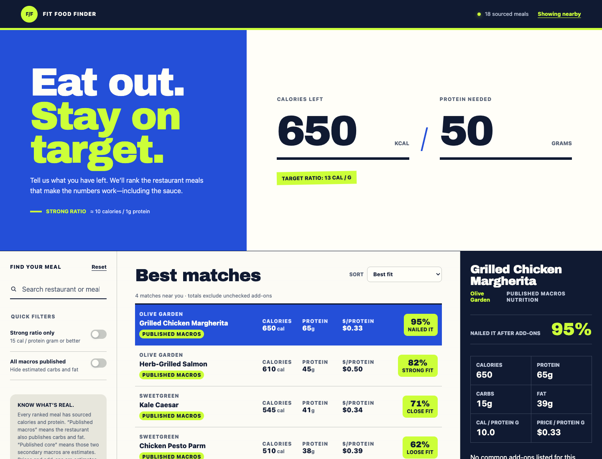

# Fit Food Finder

Find nearby restaurant meals by calorie and protein targets. The app starts a nearby scan automatically, matches the results against a daily-refreshed common-chain nutrition catalog, and uses restaurant-published location menus for item prices. No meals are embedded in the client.

The shared catalog covers 33 major US chains and is regenerated daily. Nearby discovery filters this hidden catalog before rendering, so meals from chains that were not found nearby never appear.



## Highlights

- Ranks nearby meals against calorie and protein targets.
- Shows published macros, source links, and location-specific menu prices.
- Matches OpenStreetMap restaurant results to a server-side nutrition catalog.
- Caches completed scans for six hours to avoid unnecessary repeat requests.

## Run locally

1. Copy `.env.example` to `.env.local`.
2. Add the FatSecret OAuth 1.0 consumer key and secret to `.env.local`. Do not paste secret values into chat or commit `.env.local`.
3. In this directory, run:

   ```bash
   npm start
   ```

4. Open <http://localhost:4173>.

The start command loads `.env.local`, then runs Vercel's local development server so `/api/catalog`, `/api/nearby`, `/api/nutrition`, and `/api/prices` work alongside the static app. Credentials stay in server-side functions. The first run downloads the pinned Vercel CLI version if it is not already cached.

OAuth 1.0 requests are signed server-side with HMAC-SHA1 and work with Vercel's changing outbound addresses.

## Verify

```bash
npm run check
```

After starting the app, select **Use my location**. Nearby names are matched locally against the common-chain catalog first, and nearby chains missing from it are looked up before results appear. Results are usable within a few seconds; independent restaurants and menu prices fill in afterwards in the background. When OpenStreetMap supplies an official website, the app also crawls that location's menu and attaches prices only to strong item-name matches. The selected meal shows separate nutrition and price source links. Manual search remains available for another restaurant at any time.

A completed nearby scan is cached in the browser for six hours, so reloading the page restores the results immediately without repeating location, nutrition, or price requests.
